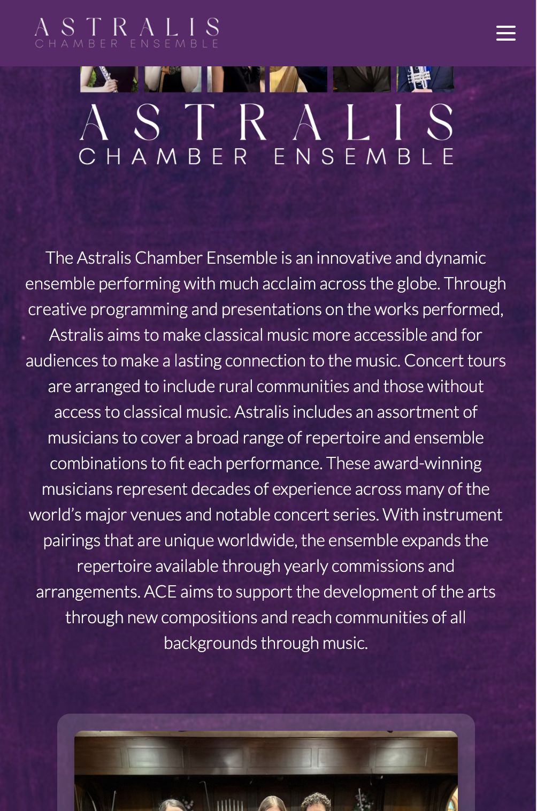

# Astralis Chamber Ensemble Website

This is a [Next.js](https://nextjs.org/) project bootstrapped with [`create-next-app`](https://github.com/vercel/next.js/tree/canary/packages/create-next-app).

## Getting Started

First, run the development server:

```bash
npm run dev
# or
yarn dev
# or
pnpm dev
```

Open [http://localhost:3000](http://localhost:3000) with your browser to see the result.

## Screenshots

Site is not live yet, but here are some screenshots of the project:
Homepage 1

Homepage 2

Mobile View

Audio Page

Contact Page

